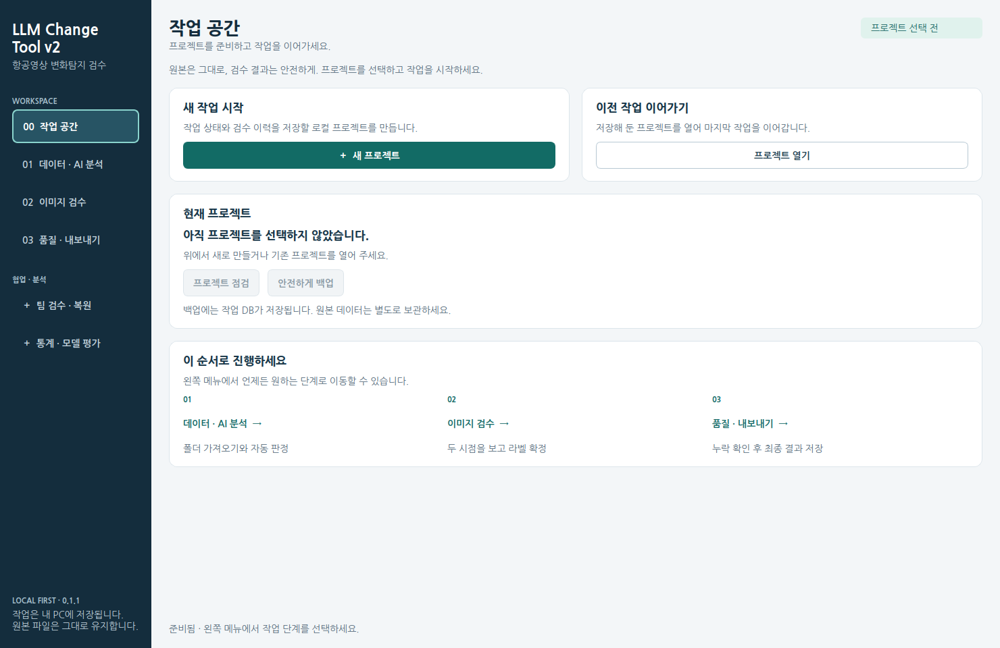
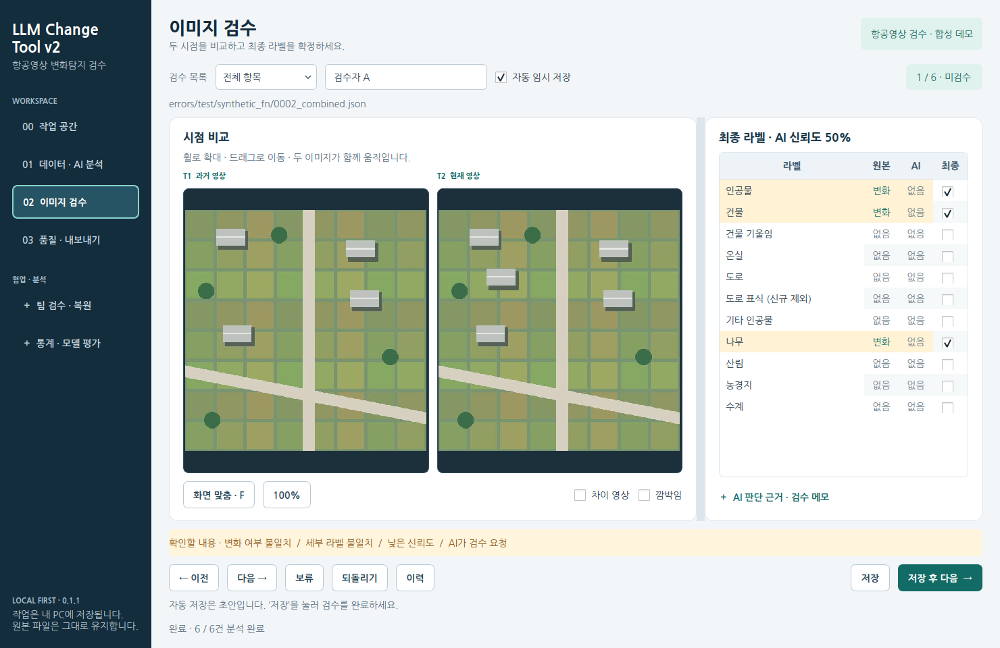
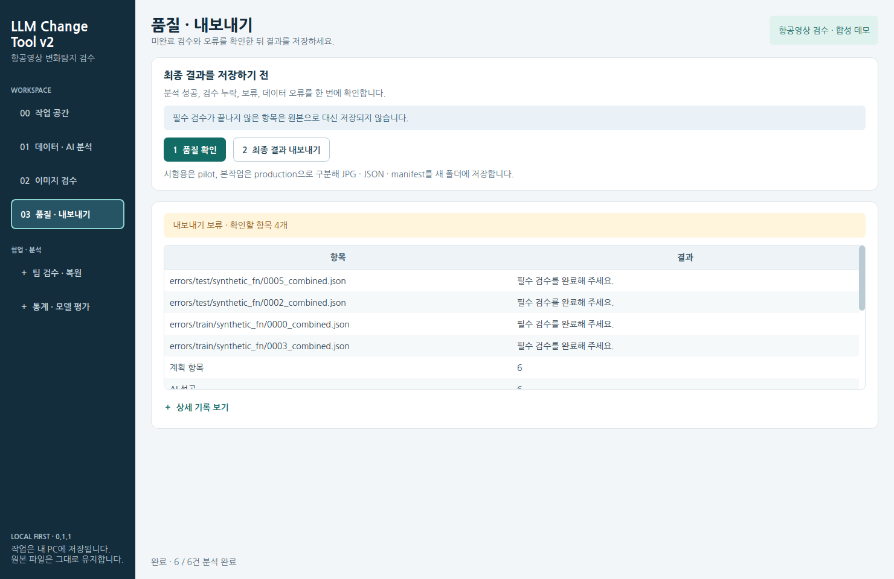

# 0.1.1 · 화면과 작업 흐름 개선

기능의 위치가 잘 보이지 않고 색상과 정보의 구분이 약하다는 피드백을 반영했습니다. 아래는 실제 PySide6 앱을 실행하여 촬영한 화면입니다. 이미지는 스크립트로 생성한 합성 예시이며 회사 데이터가 아닙니다.

## 달라진 화면

- **항상 보이는 단계별 메뉴**: 프로젝트 → 데이터·AI → 검수 → 품질·내보내기. 팀 작업과 통계는 별도 그룹에 배치했습니다.
- **글자와 색상**: 14px 기본 글자, 밝은 배경과 진한 글자, 주요 동작은 청록색 버튼, 확인이 필요한 상태는 주황색 배경과 설명을 함께 표시합니다. OS 다크 모드에서도 입력란과 글자 대비가 유지됩니다.
- **작업 설정**: 데이터 가져오기 / AI 작업 설정 / 실행을 나눴습니다. OpenAI를 선택하면 Key·모델·단가 입력이 나타나며, 프롬프트와 복구 도구는 이름이 표시된 펼침 메뉴에 있습니다.
- **검수에 집중**: T1/T2 자동 맞춤, 동기화 이동/확대, 원본·AI 불일치 행 강조, `변화 / 없음` 표시, 최종 체크박스, 저장 후 다음 버튼을 구분했습니다. AI 설명과 검수 메모는 펼쳐서 볼 수 있습니다.
- **읽을 수 있는 결과**: 진행률, 한글 요약과 표, 먼저 표시되는 품질 문제, 저장 폴더 열기 버튼을 제공합니다. 원문 JSON은 상세 기록 안에 남아 있습니다.
- **통계**: 주요 숫자는 요약 카드, Precision/Recall/F1/F2는 표로 표시합니다.







## 함께 수정한 동작

기존 프로젝트를 열었을 때 최신 분석 작업이 선택되지 않는 문제, 숨겨진 검수 페이지에서 이미지 맞춤 크기가 작게 계산되는 문제, 프로젝트 전환 후 다른 프로젝트의 품질 결과가 남는 문제를 수정했습니다. 완료된 분석은 재실행 버튼이 비활성화되며, 검수 목록으로 바로 이동할 수 있습니다.

자동 임시 저장과 완료 저장, Final Gate, 원본 불변 규칙은 유지합니다. DB 스키마 변경은 없습니다.

## 검증

전체 pytest 43개에 기존 프로젝트 재열기, 상태 초기화, 1366×768 레이아웃, 현재 화면의 오류 표시, OpenAI 설정 표시, 결과 폴더 동작 검사를 포함합니다. 1480×960 및 1366×768에서 실제 화면을 확인했습니다. Windows CI에서도 합성 데이터를 사용해 화면을 촬영하고, Portable EXE 빌드와 GUI/worker 검사를 수행합니다.

미리보기 재생성:

```bash
python scripts/capture_ui.py --output artifacts/ui
```

Linux에서 한글 폰트가 없다면 설치된 폰트 폴더를 `--font-dir`로 지정할 수 있습니다. Windows는 시스템 한글 폰트를 사용합니다. CI의 `UI-preview-Windows` artifact에는 작은 창과 메모 펼침 상태를 포함한 8개 화면이 저장됩니다.

실제 사용자 PC의 HiDPI/다중 모니터와 장시간 검수는 별도 사용성 확인이 필요합니다.
